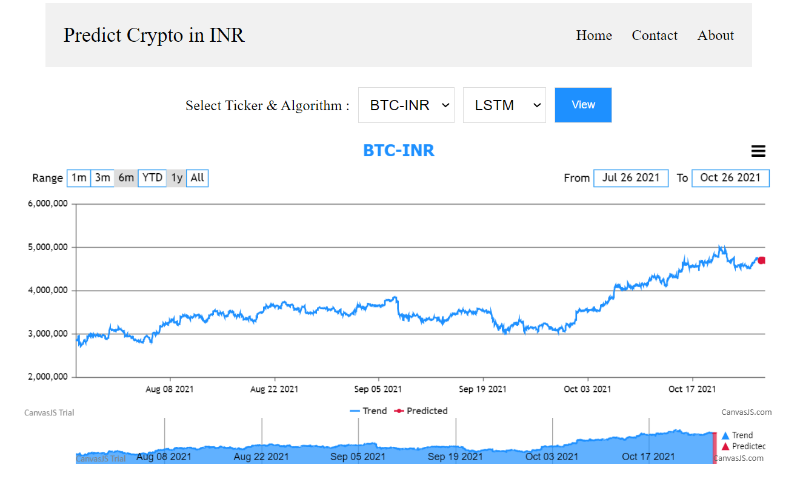
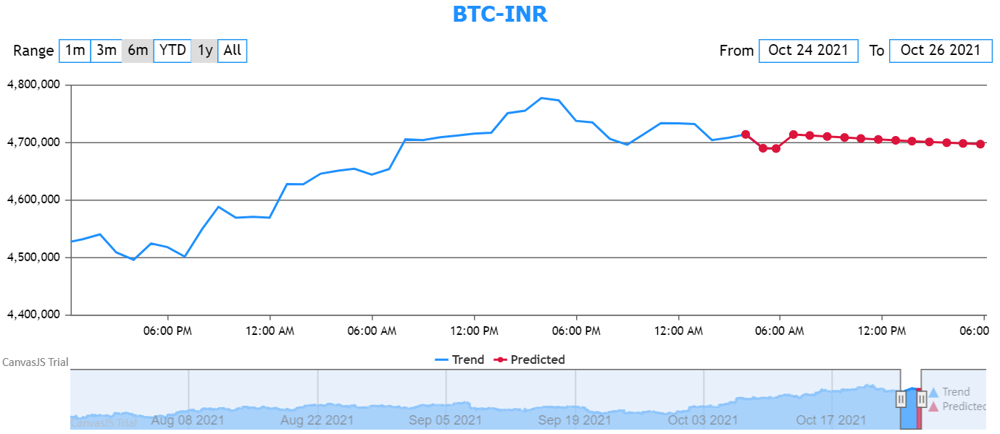

Forcasting Cryptocurrency in INR
=====================

This Project shows forecasting of Cryptocurrencies in Indian Rupees.

<!--- --->

Introduction
============
* Project performs forecasting by using different Time Series algorithms.
* Performs Next 12 hours forecasting on live crypto data.
* Supported Cryptocurrencies - BTC-INR, ETH-INR, LTC-INR, BNB-INR, DOGE-INR, USDC-INR

Installation
=============
Clone this repository and install the requirements.

Steps to Run Web App
=================
1. Direct to cloned repository path and Run main.py
2. Navigate to http://localhost:5000/
3. Select Cryptocurrency, Algorithm and click View
4. wait a minute to get result

5. Expand the chart to view exact predicted values for next 12hrs\
x-axis -> Trend, Predicted\
y-axis -> Crypto in INR

Disclaimer
================
This project gives an idea about Crypto forecasting and should not be considered as investment advice.

To Do
================
Addition of more algorithms.

